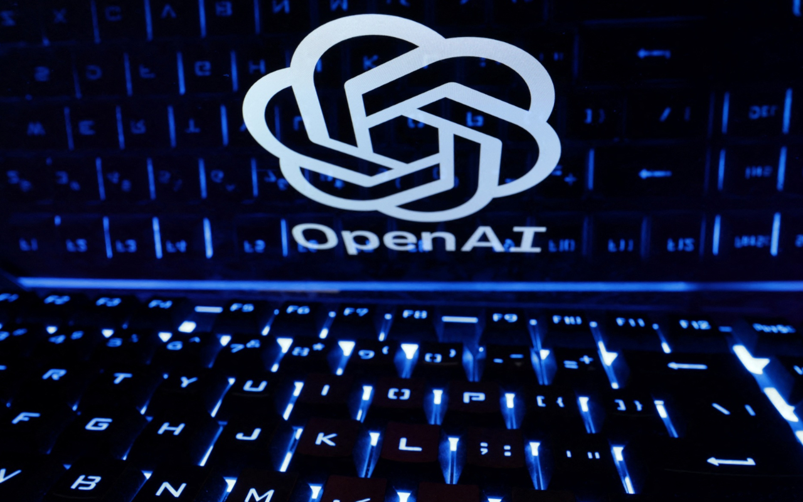

## Pope Francis Calls for International AI Treaty

Earlier this week, Pope Francis released his annual World Day of Peace message, focused this year on artificial intelligence (AI) and peace. The pope called for the global community to work together to adopt a binding international treaty regulating the development and use of AI.

Francis acknowledged the impressive achievements of AI, but also highlighted the risks, like increased inequality and loss of jobs. He emphasized the need for AI systems to uphold human dignity and rights. The pope warned about the use of AI for surveillance, manipulation, and autonomous weapons.

Francis argued that AI development must focus on serving the common good and integral human development. He said debates on AI regulation should include voices from the poor and marginalized. The pope also advocated for AI education to promote critical thinking and ethical development of algorithms.

**source:** [Artificial Intelligence and Peace](https://www.vatican.va/content/francesco/en/messages/peace/documents/20231208-messaggio-57giornatamondiale-pace2024.html)

## Deepfakes of Taylor Swift Highlight Need for Laws

Recently, deepfake pornographic images and videos of pop star Taylor Swift spread widely online, viewed tens of millions of times. These illicit deepfakes grafted Swift's face onto another woman's body without consent.

Lawyers said this massive Swift case reveals the need for stronger laws around deepfake porn, which is rising rapidly with easy-to-use apps. Nonconsensual deepfakes can enable harassment, manipulation, and reputational damage.

Currently, the US lacks comprehensive federal laws banning deepfake pornography. Some states have laws against image misappropriation and cyberstalking that may apply. Legal experts say suing deepfake creators is challenging given anonymity and jurisdictional issues. They suggest legislation focused on deepfake producers and distributors could be more effective.

**source:** [Taylor Swift and deepfake porn: What's the law?](https://www.thehindu.com/sci-tech/technology/taylor-swift-and-deepfake-porn-whats-the-law/article67803415.ece)

## Study Finds Small Risk from AI Bioweapon Assistance

OpenAI conducted a study to evaluate whether AI models could meaningfully help bad actors create biological weapons. The study had 50 biology experts and 50 students complete tasks related to biothreat creation, with half just using internet resources and half also accessing AI.

The study found a mild accuracy increase from AI access, but the effect wasn't statistically significant. However, some experts warn the study methodology may have underestimated AI risks, since public AI systems were used rather than unconstrained models.

OpenAI said this research is an initial data point, and more work is needed on assessing AI catastrophic risks. They aim to develop rigorous methodologies and collaborate across the AI safety community. Nonetheless, lawmakers are increasingly concerned about AI potential to abet biological and cyber threats.

**source:** [Building an early warning system for LLM-aided biological threat creation](https://openai.com/research/building-an-early-warning-system-for-llm-aided-biological-threat-creation)

## Older Models Like Markov Chains Retain Instructional Value

With the rapid emergence of transformer language models, older techniques like Markov chains have fallen out of favor. However, Markov chains have pedagogical value for hands-on learning.

Markov chains can model probabilistic sequences like text by analyzing transitional probabilities between textual units like words. Although modern neural networks are more performant, Markov chains offer full transparency into the underlying statistical calculations.

Implementing Markov chains from scratch provides valuable experience with statistical and matrix computations. The modular process also builds intuition about how predictive models work under the hood. While research pushes forward, revisiting classic techniques grounds an understanding of the foundations.

**source:** [Markov Chains are the Original Language Models](https://elijahpotter.dev/articles/markov_chains_are_the_original_language_models)

## Takeaways

- AI safety discussions are increasingly prominent, including high-level calls for international regulation.

- Deepfakes and AI-enabled information hazards raise complex legal and ethical dilemmas.

- Technical communities are developing methodologies for rigorous testing and open collaboration around AI risks.

- Revisiting old techniques sheds light on how new systems build on prior innovations.

AI's societal impacts remain highly complex, multifaceted, and challenging to forecast. But continued research, transparency, and cooperation can help guide progress in a responsible direction.
