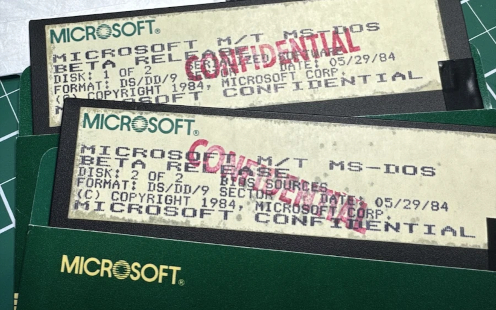

## TikTok Owner Has Strong First Amendment Case Against U.S. Ban, Professors Say

Legal experts believe ByteDance, the Chinese owner of TikTok, has a strong First Amendment argument against the recently passed U.S. law that could force a sale or ban of the popular video sharing app. The law specifically names TikTok and ByteDance, raising concerns that it constitutes an unconstitutional "bill of attainder" by singling out a specific entity for punishment without trial.

"The fact that TikTok is named by name in the bill is a potential problem. It looks a little bit like a bill of attainder type of problem," said Eric Goldman, a professor at Santa Clara University School of Law.

Beyond First Amendment issues, ByteDance could also argue the law deprives it of property without due process under the takings clause of the Fifth Amendment. Ashutosh Chander, a law professor at Georgetown, points to the 1965 Supreme Court case Lamont v. Postmaster General, where the court sided with free speech rights over restrictions on mailings containing "communist political propaganda."

However, the law's bipartisan support, passing the House 50-0 and the Senate 79-18, makes predictions difficult according to the legal experts. Some Supreme Court justices seem skeptical of tech companies, while others may defer to national security claims. The Supreme Court's stance on protecting online speech remains unclear.

**source:** [TikTok owner has strong First Amendment case against US ban, professors say](https://arstechnica.com/tech-policy/2024/04/tiktok-owner-has-strong-first-amendment-case-against-us-ban-professors-say/)

## Drake Removes Diss Track Featuring AI Tupac After Legal Threat

Rapper Drake has taken down his controversial diss track "Taylor Made" that featured AI-generated vocals mimicking late rapper Tupac Shakur. This follows legal threats from Tupac's estate, which called the song's use of the rapper's voice and likeness a clear violation done without permission.

"The Estate is deeply dismayed and disappointed by your unauthorized use of Tupac's voice and personality," said Howard King, an attorney representing the Tupac estate. "The Estate would never have given its approval for this use."

The track was part of Drake's ongoing musical feud with Kendrick Lamar, with Drake apparently using Tupac's AI-generated vocals as a jab at Lamar's well-known appreciation for the legendary rapper. While Drake quickly removed the offending song from his online profile, the incident highlights emerging legal battles around AI's ability to recreate real individuals' voices, images and likenesses without consent.

**sources:**  
[Drake threatened with lawsuit over diss track featuring AI Tupac](https://www.theverge.com/2024/4/24/24139442/tupac-ai-lawsuit-drake-taylor-made-diss-track)  
[Drake has taken down his diss track featuring AI Tupac](https://www.theverge.com/2024/4/26/24141595/drake-taylor-made-ai-tupac-takedown)

## Microsoft Open Sources MS-DOS 4.0 Code

In a historic move for preserving early computing history, Microsoft has open sourced the source code for MS-DOS 4.0 under the MIT license in partnership with IBM. The release contains not just the DOS source code written in 8086 assembly, but also original binaries, documentation, and disk images from the era.

The published materials reveal insights into the complex relationship between Microsoft's DOS development and work being done at IBM, including the origins of OS/2. Much of the materials come from a "software archeology" discovery of early betas and documentation in the possession of former Microsoft CTO Ray Ozzie.

Beyond the coding insights, the open sourced DOS 4.0 materials provide a fascinating technical snapshot of the roots of modern computing from nearly 45 years ago. Efforts are still underway to find and potentially release additional related source code like Multitasking DOS as well.

**source:** [Open sourcing MS-DOS 4.0](https://cloudblogs.microsoft.com/opensource/2024/04/25/open-sourcing-ms-dos-4-0/)

## Tesla's Autopilot Recall Now Under Federal Scrutiny

The National Highway Traffic Safety Administration (NHTSA) is raising new concerns about the effectiveness of Tesla's recent massive recall aimed at improving its Autopilot driver assistance system. After testing the updated system deployed through the recall, NHTSA says it still has open questions.

A key issue is that the recall updates allowed drivers to opt-out of safety changes or reverse them in subsequent updates, according to NHTSA. The agency also criticized Tesla's ongoing "Autopilot" branding as misleading, suggesting it encourages drivers to be overly confident in the system's capabilities compared to the reality of it being a Level 2 driver assistance feature.

NHTSA has been scrutinizing over 900 crashes involving Autopilot after first opening a probe in 2021. While excluding crashes caused by other drivers or where data was insufficient, investigators found hundreds of severe Autopilot crashes where neither the system nor inattentive drivers responded appropriately.

With at least 13 fatal crashes tied to Autopilot to date, NHTSA seems unconvinced that Tesla's recall has adequately addressed the risks of "foreseeable misuse" by drivers overly trusting the semi-autonomous system. More regulatory actions could potentially follow.

**source:** [Tesla’s 2 million car Autopilot recall is now under federal scrutiny](https://arstechnica.com/cars/2024/04/feds-concerned-some-of-teslas-autopilot-recall-was-opt-in-reversible/)
