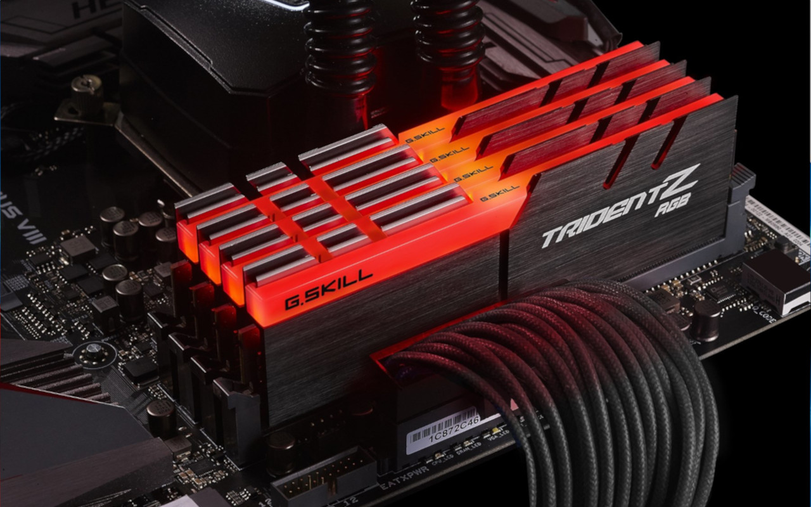
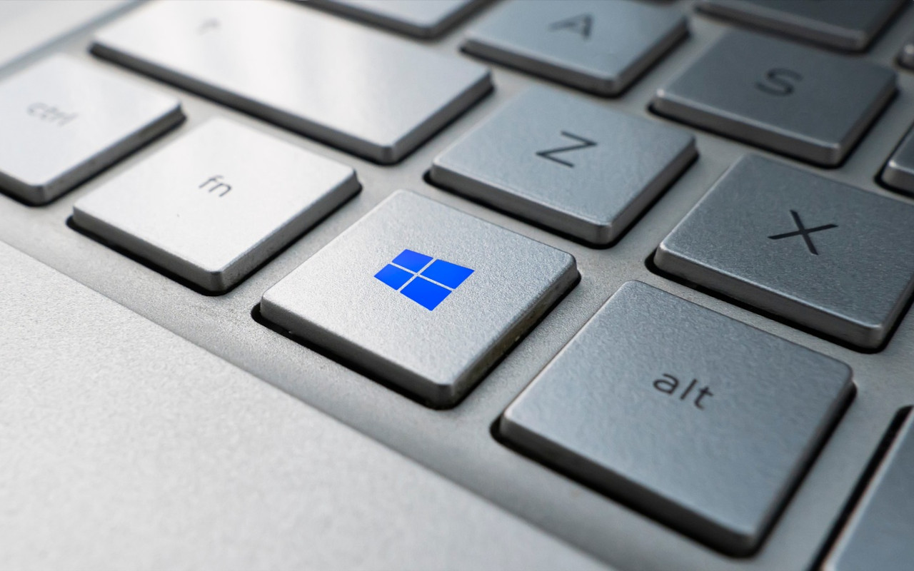

# Google Faces Astronomical Fines in Russia

In what might be the largest fine ever imposed on a company, Russian courts have demanded Google pay an almost incomprehensible sum of 2 undecillion rubles (that's a number with 36 zeros!) for failing to restore blocked Russian media channels on YouTube. To put this in perspective, this amount far exceeds the entire world's GDP, which sits at around $100 trillion.

The dispute began in 2020 when YouTube blocked certain Russian channels due to U.S. sanctions, with tensions escalating after February 2022 when more channels were blocked. While Google has essentially withdrawn from Russia, declaring its local subsidiary bankrupt in 2022, the legal battle continues globally, with Russian media attempting to seize Google's assets in various countries including Turkey, Hungary, Spain, and South Africa.

# Memory Speed Records Shattered with DDR5

In more positive news, the PC hardware community is celebrating a remarkable achievement in memory overclocking. Four extreme overclockers have managed to push G.SKILL DDR5 memory beyond the 12,000 MT/s barrier, with the highest speed reaching 12,066 MT/s. This feat was accomplished using:

- Intel Core Ultra 9 285K desktop processor
- ASUS ROG Maximus Z890 Apex motherboard
- Liquid nitrogen cooling

The achievement demonstrates the incredible potential of DDR5 technology and sets a new benchmark for memory performance. Shortly after, another overclocker named Safedisk pushed the record even further to 12,112 MT/s, showing just how competitive the overclocking scene remains.

# Microsoft's Vision for AI-Powered Windows

Microsoft is developing an ambitious project called "Windows Agent Arena" that could revolutionize how we interact with our PCs. This open-source framework allows developers to create AI agents capable of performing complex tasks on Windows 11 automatically.
Some potential applications include:

- Automating morning routines by opening specific apps and websites
- Changing system settings through natural language commands
- Managing privacy settings across applications
- Installing software and extensions
- Performing file management tasks

The current AI agent prototype, named Navi, has achieved a 19.5% success rate in task completion - while this might seem low compared to human performance (74.5%), it represents a significant milestone in autonomous computer operation.
